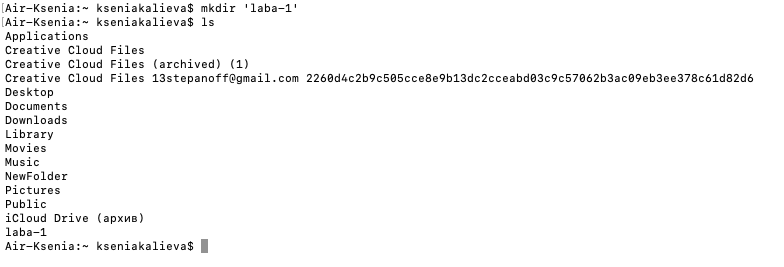
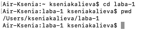
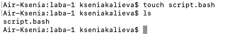
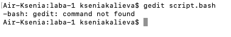

1. Создадим отдельную директорию для лабораторной работы с помощью команды
```bash
mkdir laba-1
```
чтобы не было лишних файлов. С помощью команды `ls` убедимся, что директория создана:



2. Перейдём в созданную директорию с помощью команды `cd laba-1`,  с помощью команды `pwd` убедимся, что находимся в нужной директории:




3. Создадим новый файл с именем `script.bash` с помощью команды:
```bash
touch script.bash
```
С помощью команды `ls` убедимся, что файл создан



4. При попытке открыть файл через текстовый редактор `gedit`, команда не была найдена:


Стало ясно, что редактор gedit не установлен, поэтому воспользуемся встроенным текстовым редактором `vim`


5. Откроем файл с помощью команды
```bash
vim script.bash
```
Нажав клавишу `i` перейдём в режим вставки и вставим скрипт:


